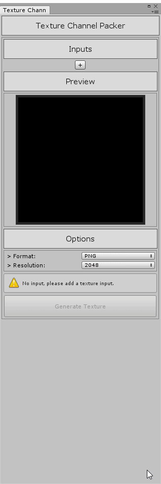

unity-texture-packer [](http://mit-license.org) [](https://www.paypal.me/andyduboc/5usd)
==========


:hammer: Utility to merge different texture channels into a final texture output. 



## Install

### Using Git

Make sure the Git client is installed on your marchine and that you have added the Git executable path to your PATH environment variable.

Go in %ProjectFolder%/Packages/ and open the "manifest.json" file.

in the "dependencies" section add:

```sh
{
  "dependencies": {
      ...
      "ca.andydbc.unity-texture-packer":"https://github.com/andydbc/unity-texture-packer.git#0.1.0"
      ...
  }
}
```

Find more information about this [here](https://docs.unity3d.com/Manual/upm-git.html).

### Manual 

Dowload this repository as a zip file, extract the archive. <br>
In Unity, go in "Window" -> "Package Manager"  -> "Add Package from disk"<br>
Select the "package.json" file located at the root of the package folder.<br>

The tool is located under "Window" and is called "Channel Packer"

## Note

This is still under development and may be buggy.

## License

MIT. See [LICENSE](https://github.com/andydbc/unity-texture-packer/blob/master/LICENSE) for details.
