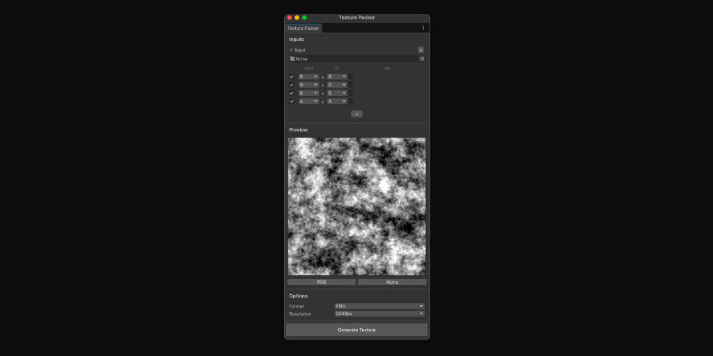

# unity-texture-packer

Utility to merge different texture channels into a final texture output.



## Install

### Using Git

In Package Manager, press Install package from git url, past the github url:

```sh
https://github.com/andydbc/unity-texture-packer.git
```

### npm

```
TODO
```

## License

MIT. See [LICENSE](https://github.com/andydbc/unity-texture-packer/blob/master/LICENSE) for details.
