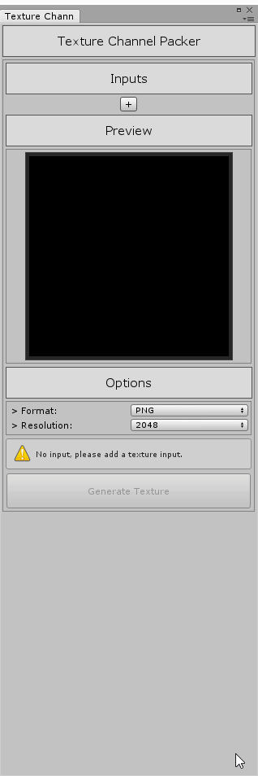

unity-texture-packer  
==========

:hammer: Utility to merge different texture channels into a final texture output. 

## Install

### Using Git

Make sure the Git client is installed on your marchine and that you have added the Git executable path to your PATH environment variable.

Open Unity and go to `Window > Package Manager`.  
In the Package Manager window, click the `+` button and select `Add package from git URL...`.  
Paste the following URL: `https://github.com/andydbc/unity-texture-packer.git`.  
Click `Add`.

### Manual 

Dowload this repository as a zip file, extract the archive.  
In Unity, go in "Window" -> "Package Manager"  -> "Add Package from disk" 
Select the "package.json" file located at the root of the package folder. 

The tool is located under "Window" and is called "Channel Packer"

## Note

This is still under development and may be buggy.

## License

MIT. See [LICENSE](https://github.com/andydbc/unity-texture-packer/blob/master/LICENSE) for details.
