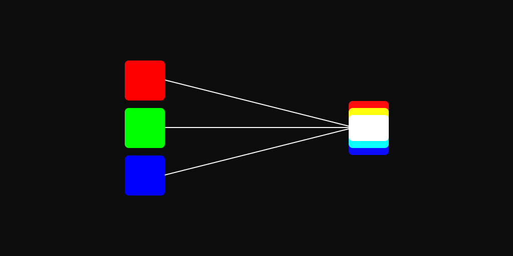
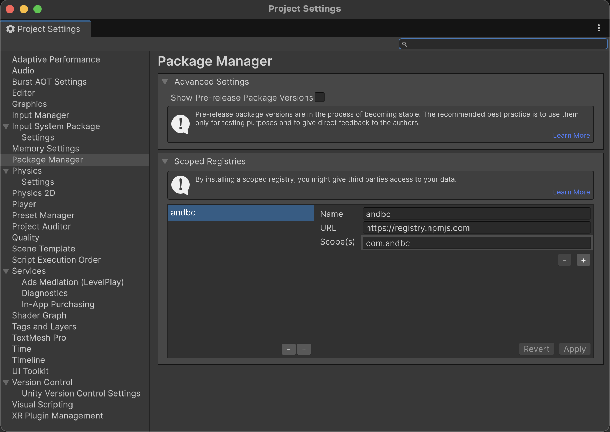
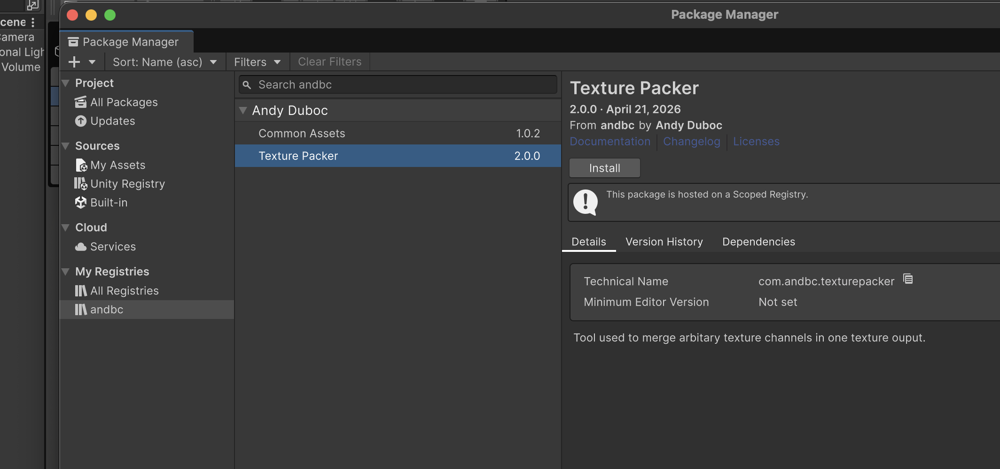

# unity-texture-packer

Utility to merge different texture channels into a final texture output.



## Install

### Using Git

In **Package Manager**, press Install package from git url, past the github url:

```sh
https://github.com/andydbc/unity-texture-packer.git
```

### npm

1. Open **Project Settings**, find the  **Package Manager** tab amd add the following registry:



2. Open the **Package Manager** window and find the newly added registry in **My Registries**



Install the tool.

## License

MIT. See [LICENSE](https://github.com/andydbc/unity-texture-packer/blob/master/LICENSE) for details.
